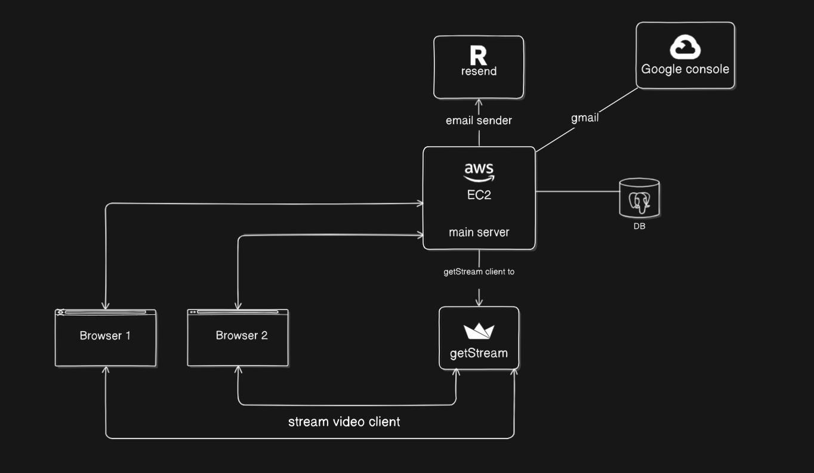

# HeyMint 💬✨
<table>
<tr>
<td>
  HeyMint is a modern platform designed to make meetings more meaningful and effortless. Whether you're hosting a paid session or a free instant meeting, HeyMint gives users a smooth experience from joining to interacting — without the friction of complicated tools or confusing workflows. With a clean interface, secure authentication, and structured flow, it helps creators, mentors, consultants, and communities run effective sessions that actually feel personal and valuable.
</td>
</tr>
</table>

## 🚀 Features
 
 - 🔐 Access + Refresh token-based security
 
- 🧑 User management (Sign up / Login)

- 📅 Paid and unpaid meeting scheduling

- 💳 Payments and purchase tracking

- ⚡ Fast Vite-based React frontend

- 📦 Express + Prisma backend with PostgreSQL

## 💡 Architecture

## 🛠️ Tech Stack
**Frontend**
- React (Vite)
- Tailwind CSS
- Shadcn/UI
- Framer Motion

**Backend**
- Node.js
- Express.js
- Prisma ORM

**Database**
- PostgreSQL

**Authentication**
- OTP based login (Resend)
- Google OAuth 2.0 (Passport)

**SDK Used**
- GetStream

© [Abhay Pratap Singh ](https://github.com/drrakonov)

